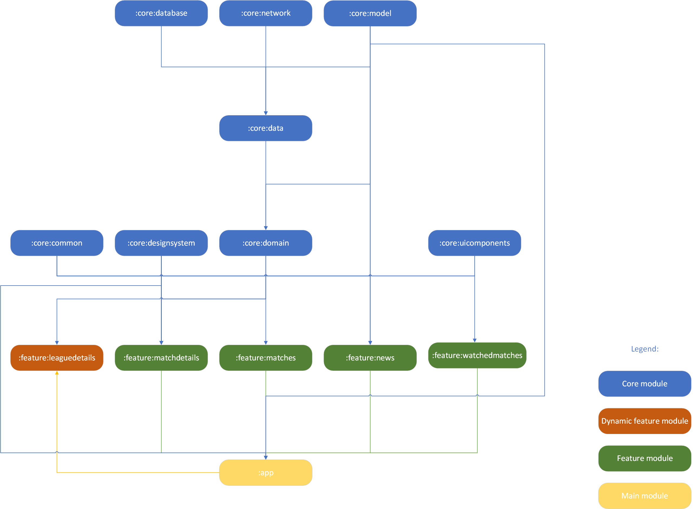
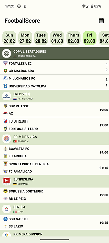

# FootballScore

<b>Android application for checking the results of football games. App is currently under the development. User currently has access to two screens, 
one with all games that are played on the selected day and the second one with game details. To create the layout I am using Jetpack Compose library and for the asynchronous code Kotlin Flow and Coroutines.</b>

### Table of contents
* [Used REST API](#used-rest-api)
* [How to build and run the app](#how-to-build-and-run-the-app)
* [Supported Android versions](#supported-android-versions)
* [Tech stack](#tech-stack)
* [Architecture and modularization](#architecture-and-modularization)
* [Plans for future](#plans-for-future)
* [App design](#app-design)

### Used REST API

In this app I am using [football-data.org](https://www.football-data.org/documentation/quickstart) REST API for all the data displayed in the app.

### How to build and run the app

To build and start the app on the device:

* Create authorization key required by the REST API on this website [football-data.org](https://www.football-data.org/documentation/quickstart)
* Paste authorization key to the gradle.properties file (Directory of the file: C:\Users\username\.gradle): API_KEY=your_api_key
* open the cmd console in the root location of this project
* run .\buildAndDeployAppBundle.bat script

NOTE: This script works only on windows system and you also should add java and adb paths to the environment variables.

### Supported Android versions

Application is available for devices with at least Android 10 version.

### Tech stack

* Kotlin
* UI - [Jetpack Compose](https://developer.android.com/jetpack/compose?gclsrc=ds&gclsrc=ds)
* UI design - [Material Design 3](https://m3.material.io/)
* Asynchronous tasks - [Coroutines](https://kotlinlang.org/docs/coroutines-overview.html) and [Kotlin Flow](https://kotlinlang.org/docs/flow.html)
* Dependency Injection - [Hilt](https://developer.android.com/training/dependency-injection/hilt-android)
* Networking - [Retrofit](https://square.github.io/retrofit/) and [OkHttp](https://square.github.io/okhttp/)
* Logging - [Timber](https://github.com/JakeWharton/timber)
* Animations - [Lottie Animations](https://airbnb.design/lottie/)
* [Play Feature Delivery](https://developer.android.com/guide/playcore/feature-delivery)
* [Firebase Crashlytics](https://firebase.google.com/docs/crashlytics?hl=pl)

### Architecture and modularization

FootballScore is based on the MVVM architecture, repository and use-case patterns. 
For the modularization I chose the architecture recommended by Google in this [article](https://developer.android.com/topic/modularization) and used in this [sample app](https://github.com/android/nowinandroid).
Modules are split into two categories: core and feature. In core modules I have modules like network, uicomponents, data, domain, etc. In feature every module is created for different screen.

Core modules:

* common - Common code shared between all modules
* data - module with repositories
* designsystem - module for set up of theme, colors, etc.
* domain - module for use cases
* model - module with all models used in the app
* network - module for whole networking communication (for example communication with REST API)
* uicomponents - module for components used in the app

Feature modules:

* leaguedetails - module for league details screen. It's dynamic feature module so it has to be downloaded on runtime before first usage. Dynamic feature module has access to the app module code.
* matchdetails - module for screen with match details
* matches - module for screen with the list of games played in the chosen day

### Plans for future

* Adding new screens like team details, favorite teams, favorite games, settings
* Adding ROOM database for caching some data from REST API

### App design

